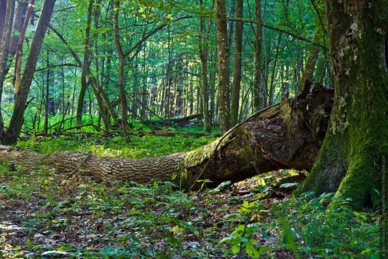
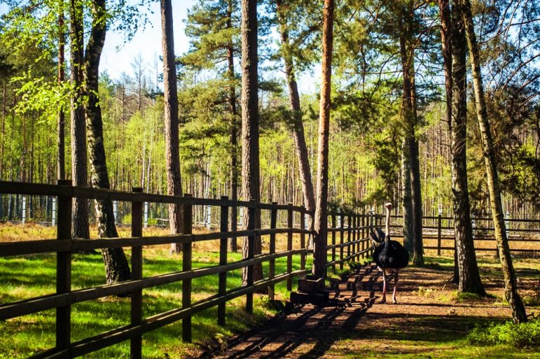
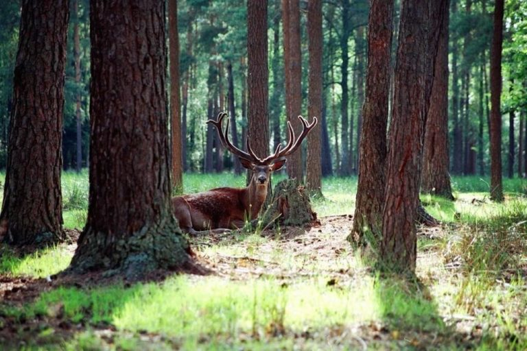
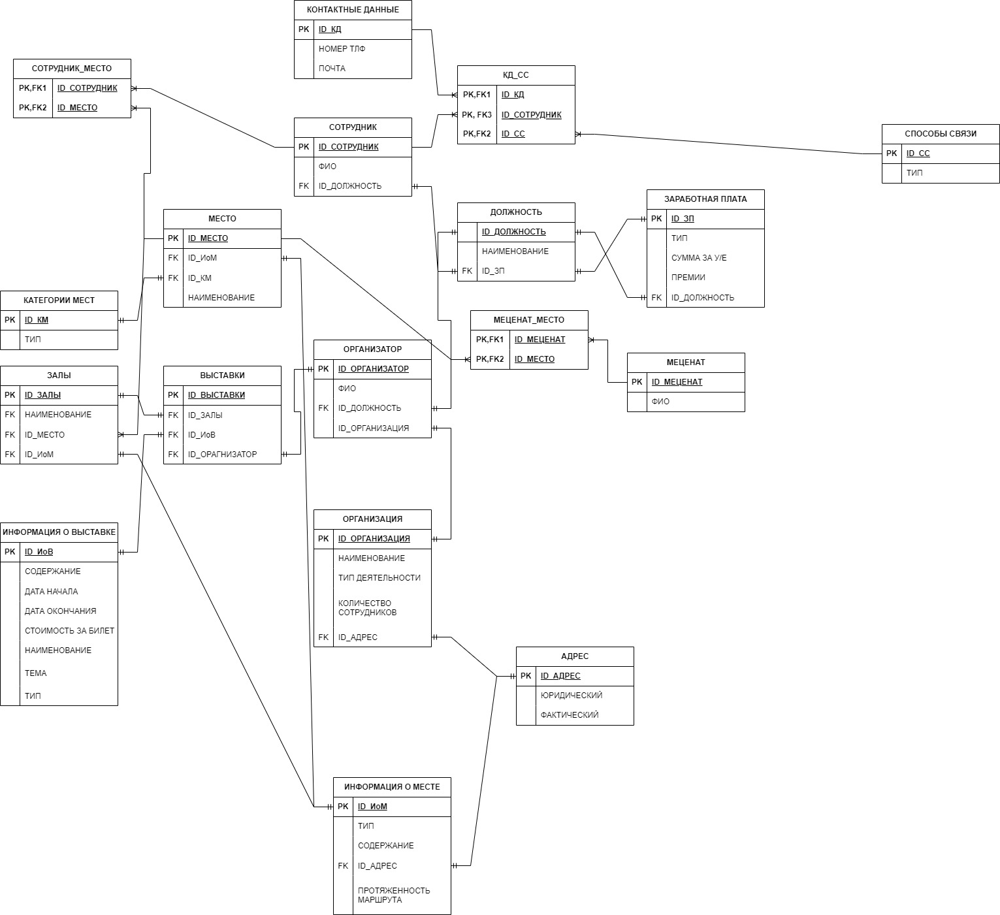

# Задача "Сформировать структуру базы данных для музея"

-  Посетить любой музей в вашем городе. Сделать фотоотчет (фото музея, себя на фоне музея/внутри музея)  
-  Составить в экселе базу данных со следующей структурой: название таблиц, название полей, название параметров, описание полей, описание параметров.
-  База данных должна включать не менее 30 таблиц!  
-  Нарисовать взаимосвязи таблиц (miro/draw.io/excel).  
-  Написать сценарий использования созданной базы данных.

#### Просто комментарий
У меня немного проблемы с самооценкой, поэтому прошу прощения за то, что моих фотографий на фоне такого прекрасного места не будет.

## Описание решения задачи
В рамках выполнения домашнего задания и для модуля "База данных в музее" была посещена Беловежская пуща.

### Описание места
Несомненно, самый известный и крупный национальный парк Беларуси — «Беловежская пуща», расположенная в Брестской области. Это наиболее крупный остаток реликтового первобытного равнинного леса на территории Европы. В 1992 году решением ЮНЕСКО Государственный национальный парк «Беловежская пуща» включён в Список Всемирного наследия человечества.

### Фотоотчет

 

## Сценарий использвания базы данных

Данная база данных расчитана на то, чтобы отслеживать какие сотрудники за какую часть отвечают (экскурсии, запись на них), а так же, какие выставки и в каком месте можно было бы сделать

- Схема взаимосвязей
